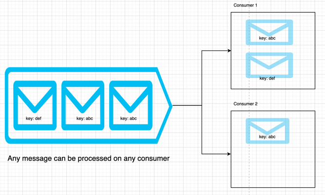
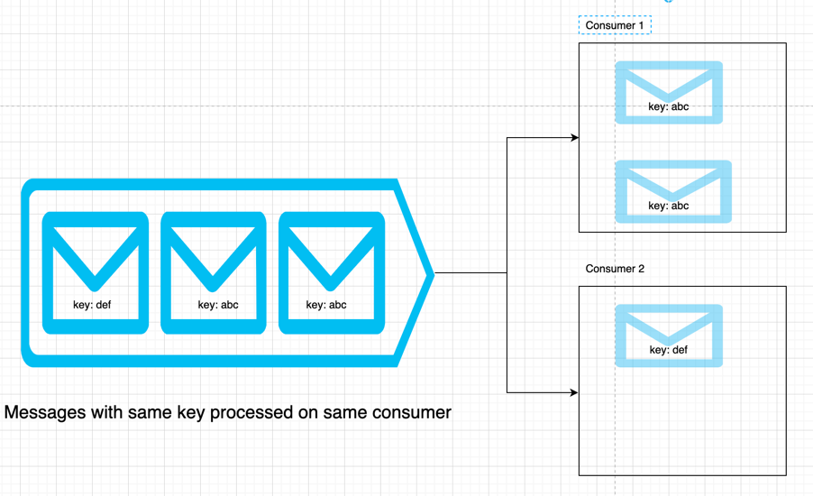

# segmenter

[](https://codecov.io/gh/hextechpal/segmenter)
[](http://pkg.go.dev/github.com/hextechpal/segmenter)

Package segmenter implements partition over redis streams

Redis streams are great, fast and easy to use. But sometimes we want to ensure ordering in processing of messages
This library guarantees that all the messages based on a partition key are processed in order on a single consumer
It also allows does re-balancing i.e. if a consumer is added/removed(dies) then the partitions are rebalanced
and the ordering property is followed
 
Without segmenter




With segmenter





## Segmenter

This is how the segmenter is initialized. Namespace is the logical container for segmenter.
You can initialize multiple segmenter in same app with different namespaces or in diff apps with same namespaces
(given underlying redis connection is same). Once initialized segmenter can be used to register streams and consumers.

```go
c := segmenter.Config{
	RedisOptions: &redis.Options{Addr: "localhost:6379"},
	NameSpace:    "namespace",
	Debug:        false,
}
s, err := segmenter.NewSegmenter(&c)
```

## Stream

Stream can be registered with the segmenter by passing in the name, partitionCount and partitionSize.
If multiple apps try to register the stream by same name they will be returned the stream object using the properties
which created it first and the newer properties (partition count and size are ignored, library will throw an exception
in next release if properties are modified).
Also streams are immutable i.e once created you cannot update the partition size or count

```go
//Register a stream with name segmenter, 2 partitions and partition size 150
st, err := s.RegisterStream(ctx, "segmenter", 2, 250)
if err != nil {
	log.Fatalf("RegisterStream(), err = %v", err)
}
```

After registering you can use this stream to send messages

```go
// It sends 10 messages to the stream which will be divided across two partitions of the stream
for i := 0; i < 10; i++ {
	uuid := fmt.Sprintf("uuid_%d", rand.Intn(1000))
	_, _ = st.Send(context.TODO(), &contracts.PMessage{
		Data:         []byte(fmt.Sprintf("Message with uuid : %s", uuid)),
		PartitionKey: uuid,
	})
}
```

## Consumer

Similar to the stream you can register the consumer using the segmenter. A stream should be registered with the
segmenter before you register the consumer. If not you will get ErrorNonExistentStream

```go
// Here we are registering a consumer
// stream : "segmenter"
// group : "group1"
// batchSize : 10 (similar to redis count)
// maxProcessingTime : 1 sec. If the message is not acked in 1 sec we will ry to redeliver it
c, err := seg.RegisterConsumer(ctx, "segmenter", "group1", 10, time.Second)
if err != nil {
	log.Fatalf("Consumer1 : registerConsumer() err = %v", err)
}
```

Once you have the message you can ack the message so that it will be marked processed

```go
err := c.Ack(ctx, m)
log.Printf("Consumer1 : registerConsumer() err = %v", err)
```

You can shut down the consumer using the ShutDown method. This will cause the partitions to rebalance

```go
err = c.ShutDown()
if err != nil {
	log.Fatalf("Error happened while shutting down c, %v", err)
}
```

For more details you can check out the tests/e2e package. It contains end-to-end test which explains these concepts
in more detail
